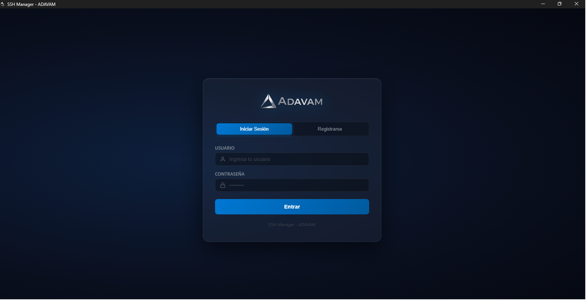
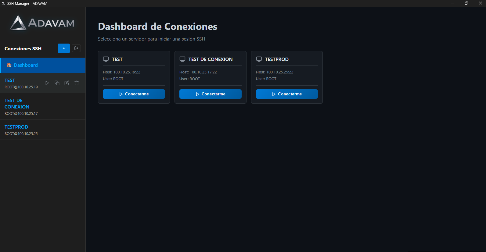
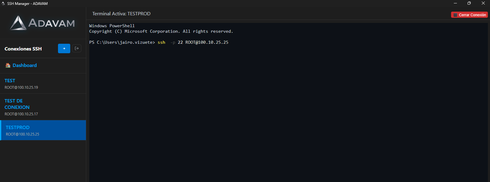

<p align="center">
  
</p>

<h1 align="center">SSH Manager — ADAVAM</h1>

<p align="center">
  Aplicación de escritorio para gestionar y administrar conexiones SSH de forma segura, con terminal integrada y base de datos local.
</p>

<p align="center">
  
  
  
  
  
  
</p>

---

## 📸 Capturas de Pantalla

| Login | Dashboard | Terminal |
|:-----:|:---------:|:--------:|
|  |  |  |

---

## ✨ Características

- 🔐 **Autenticación segura** con bcryptjs (hash de contraseñas)
- 🗄️ **Base de datos local** SQLite — sin servidores externos
- 💻 **Terminal SSH integrada** con xterm.js y node-pty
- 🧩 **Gestión de conexiones** — agregar, editar, eliminar
- 🔑 **Soporte de autenticación** por contraseña o llave privada SSH
- 📦 **Instalador nativo** para Windows generado con electron-builder

---

## 🗄️ Base de Datos SQLite

La base de datos se almacena automáticamente en la carpeta de datos del usuario:

```
Windows: C:\Users\<usuario>\AppData\Roaming\ssh-manager\ssh-manager.db
```

### Esquema de tablas

#### Tabla `users`
| Campo | Tipo | Descripción |
|-------|------|-------------|
| `id` | TEXT (PK) | UUID único generado automáticamente |
| `username` | TEXT UNIQUE | Nombre de usuario |
| `name` | TEXT | Nombre del usuario |
| `lastname` | TEXT | Apellido del usuario |
| `email` | TEXT UNIQUE | Correo electrónico |
| `password` | TEXT | Hash bcrypt de la contraseña |

#### Tabla `connections`
| Campo | Tipo | Descripción |
|-------|------|-------------|
| `id` | TEXT (PK) | UUID único |
| `name` | TEXT | Nombre del perfil |
| `host` | TEXT | IP o hostname del servidor |
| `port` | INTEGER | Puerto SSH (default: 22) |
| `username` | TEXT | Usuario SSH |
| `auth_type` | TEXT | `password` o `key` |
| `password` | TEXT | Contraseña (opcional) |
| `key_path` | TEXT | Ruta a llave privada SSH (opcional) |

---

## 📁 Estructura del Proyecto

```
ssh-manager/
├── main.js                   # Proceso principal de Electron (IPC, DB, PTY)
├── package.json              # Configuración del proyecto y dependencias
├── angular.json              # Configuración de Angular CLI
├── public/                   # Recursos estáticos
│   ├── logo.png              # Logo principal
│   ├── logo-single.png       # Ícono de la aplicación (instalador)
│   └── favicon.ico           # Favicon de la pestaña
└── src/
    ├── index.html            # HTML raíz
    ├── main.ts               # Bootstrap de Angular
    ├── styles.css            # Estilos globales
    └── app/
        ├── app.ts            # Componente principal
        ├── app.html          # Template principal
        ├── app.css           # Estilos del componente principal
        ├── app.routes.ts     # Rutas de la aplicación
        ├── ipc.service.ts    # Servicio de comunicación IPC con Electron
        └── login/
            ├── login.ts      # Componente de autenticación
            ├── login.html    # Template del login
            └── login.css     # Estilos del login
```

---

## 🔧 Configuración

### electron-builder (`package.json`)

```json
"build": {
  "appId": "com.ssh-manager.app",
  "productName": "SSH Manager",
  "win": {
    "icon": "public/logo-single.png"
  }
}
```

### Angular (`angular.json`) — Presupuestos de bundle

```json
"budgets": [
  { "type": "initial", "maximumWarning": "1MB",  "maximumError": "1.5MB" },
  { "type": "anyComponentStyle", "maximumWarning": "10kB", "maximumError": "15kB" }
]
```

---

## 📦 Versiones

| Tecnología | Versión |
|------------|---------|
| Angular | 22.1.x |
| Angular CLI | 22.1.7 |
| Electron | 44.2.x |
| electron-builder | 26.15.x |
| TypeScript | 6.0.x |
| Node.js | ≥ 20.x |
| npm | 11.12.1 |

### Dependencias principales

| Paquete | Versión | Uso |
|---------|---------|-----|
| `better-sqlite3` | ^13.0.3 | Base de datos SQLite local |
| `bcryptjs` | ^3.0.3 | Hash seguro de contraseñas |
| `node-pty` | ^1.1.0 | Terminal pseudoterminal nativa |
| `@xterm/xterm` | ^6.0.0 | Renderizado de terminal en UI |
| `@xterm/addon-fit` | ^0.11.0 | Ajuste automático de terminal |
| `rxjs` | ~7.8.0 | Programación reactiva |
| `concurrently` | ^10.0.5 | Ejecutar Angular + Electron en paralelo |
| `wait-on` | ^9.1.0 | Esperar a que Angular esté listo antes de Electron |

---

## 🚀 Instalación y Uso

### Prerrequisitos

- **Node.js** ≥ 20.x — [nodejs.org](https://nodejs.org)
- **npm** 11.x (incluido con Node.js)
- **Visual Studio Build Tools** con soporte para C++ (requerido por `node-pty` y `better-sqlite3`)
  - Instala desde: [Instalador de Visual Studio](https://visualstudio.microsoft.com/downloads/)
  - Componentes necesarios: **Desarrollo de escritorio con C++**

### 1. Clonar el repositorio

```bash
git clone https://github.com/tu-usuario/ssh-manager.git
cd ssh-manager
```

### 2. Instalar dependencias

```bash
npm install
```

### 3. Modo desarrollo

Inicia Angular y Electron en paralelo con hot-reload:

```bash
npm start
```

> La app detecta automáticamente si hay usuarios en la DB.
> - **Sin usuarios** → muestra el formulario de registro
> - **Con usuarios** → muestra el formulario de login

### 4. Generar instalador para Windows

```bash
npm run electron:build
```

El instalador se genera en:
```
dist/ssh-manager Setup 0.0.0.exe
```

---

## 🔐 Seguridad

- Las contraseñas se almacenan usando **bcryptjs** con salt rounds = 10
- La base de datos SQLite es **local** y no se transmite a ningún servidor
- Las contraseñas SSH se guardan en texto plano en SQLite — se recomienda usar **llaves SSH** para entornos de producción

---

## 📄 Licencia

MIT — ADAVAM © 2026
